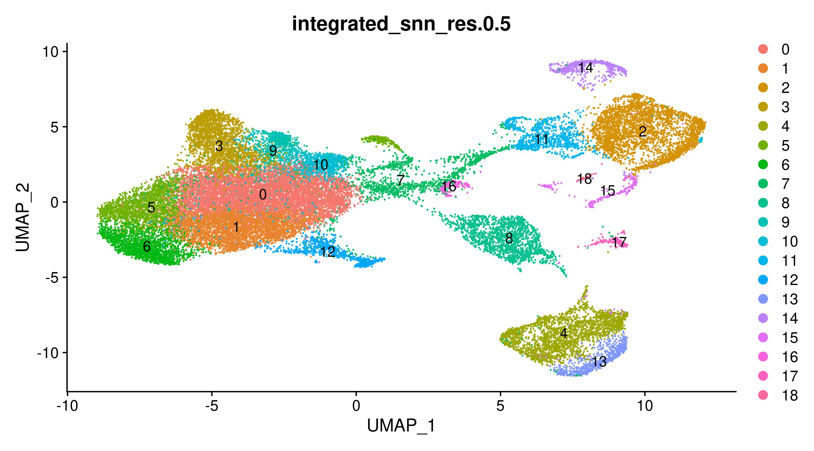

```{r setup, include=FALSE}
knitr::opts_chunk$set(echo = TRUE)
library(tidyverse)
library(kableExtra)

```


# 00-Intro  

- This document outlines all the steps taken in the analysis of the mastitis single cell RNAseq data  
- Each heading corresponds to one step/script in the pipeline.  
- Code chunks can be expanded to see the script for each step.  
- All code is available at https://github.com/Jtrachsel/mastitis_scRNAseq
  - will fork to https://github.com/USDA-FSEPRU/mastitis_scRNAseq  
- important QC cutoffs are set in 09_QC  
  - percent mitochondrial, min transcripts etc.  
  
  
## Outputs    
- The end product of this pipeline is a Seurat object with each cluster assigned to a broad category based on an input marker gene / cell type spreadsheet.  
- extended annotations of the detected genes are also mapped and downloaded from ensembl  
  - GO terms, homologues etc.  
- Figures describing the classification and abundance of identified clusters are in section 13_general_cluster_identity 


  
  
___  
___  
___  

  
# 01-Extract Raw data  
  
- scripts/01_tar.slurm  
  
```{bash, eval=FALSE, code = readLines("scripts/01_tar.slurm")}
```

# 02-Prepare reference genome  
  
- scripts/02_cellranger_reference_prep_script.slurm  
  
```{bash, code=readLines("scripts/02_cellranger_reference_prep_script.slurm"), eval=FALSE}
```
  
# 03-FastQC  
  
- scripts/03_fastQC.slurm  
  
```{bash, code=readLines("scripts/03_fastQC.slurm"), eval=FALSE} 
```

# 04-Cellranger  

- This script creates a slurm job arrary to perform a cellranger mapping job for each partitioning sample  
- scripts/04_cellranger_map_individual.slurm    
  
```{bash, eval=FALSE, code=readLines("scripts/04_cellranger_map_individual.slurm")}
```

# 05-Cellranger QC metrics {.tabset}  

- This script checks some summary statistics from the Cellranger runs  
- scripts/05_check_mapping.R  


## Figures    


  


### Cellranger mapping summary  
  
```{r, echo=FALSE, message=FALSE, warning=FALSE}
summarydat <- 
  read_tsv('outputs/first_cellranger_results.tsv') %>% 
  select(-`Number of Reads`) %>% 
  mutate(ID=paste0(individual, tissue)) %>% 
  select(ID, everything(),-individual, -tissue,)
  

summarydat %>%  kable() %>% kable_styling(bootstrap_options = 'striped', font_size = 10)
```
  
## Code  
  
```{r, eval=FALSE, code=readLines('scripts/05_check_mapping.R')}

```
    
  
# 06-Ensembl Gene info  

- Map detected gene ids to ensembl database to get info  
  - Gene names  
  - Orthologues  
  - GO terms  
  - Other?  
  
```{r, eval=FALSE, code=readLines('scripts/06_map_gene_ids.R')}
```

# 07-Ambient RNA removal with SoupX {.tabset}  
  
- An R script defines the SoupX commands used  
- A bash script defines a slurm job to run the R script  
  
## Figures {.tabset}  

### 1312 blood  
#### pre-SoupX  
  
  
#### post-SoupX  
  
  

### 1312 milk  
#### pre-SoupX  
  
  
#### post-SoupX  
  
  
### 1630 blood  
#### pre-SoupX  
  
  
#### post-SoupX  
  
  

### 1630 milk  
#### pre-SoupX  
  
  
#### post-SoupX  
  
  
### 1634 blood  
#### pre-SoupX  
  
  
#### post-SoupX  
  
  

### 1634 milk  
#### pre-SoupX  
  
  
#### post-SoupX  
  
  
## Code  
  
```{r, eval=FALSE, code=readLines('scripts/07_SoupX.R')}

```  
 
# 08-Doublet removal with scDblFinder  
  
- An R script defines the scDblFinder commands to be run.  

- Follows the introductory vignette  
  - https://bioconductor.org/packages/devel/bioc/vignettes/scDblFinder/inst/doc/introduction.html  
  
- Run using the 'multiple samples' suggestions:
  - https://github.com/plger/scDblFinder#multiple-samples  


## Code  
  
```{r, code=readLines('scripts/08_scDblFinder.R'), eval=FALSE}
```  
  
  
# 09-QC and cell removal {.tabset}  

- Generates basic per-cell QC metrics  
  
- Removes "bad" cells based on these criteria:  
  - Doublets  
  - Greater than 10% mitochondrial reads  
  - Less than 150 detected genes  
  - Greater than 3000 detected genes  
- rRNA depletion partially failed for one sample  
  - removed rRNA genes from downstream analysis  
  - most cells in all but one sample had no rRNA genes

- Outputs a Seurat object for downstream use  

## Figures  
  
### rRNA depletion issues  
  
  
  
### Cutoff for percent mitochondrial reads  

  
  
### Doublets  
  
  
  
### NUmber of cells removed    
  
  
  
## Code  
  
```{r, eval=FALSE, code=readLines('scripts/09_QC.R')} 
```  


  

# 10-Seurat Integrate {.tabset}  

- Integrates all partitioning events.  
- Checks 2 different options for integration  
  - Integrate by Tissue (Blood, Milk)  
    - no integration for samples within a tissue, then integrates the two tissues  
  - Integrate by sample_ID  
    - integrates each partitioning event one by one  
- Follows Seurat integration tutorial  
- No major differences between the integration strategies  
  
## Code  
```{r, eval=FALSE, code=readLines('scripts/10_integrate.R')}
```
  
  
# 11-Cluster {.tabset}  

- Explores "dimensionality" of data  
- For each integration method:  
  - Clusters the cells using various choices of dimensionality  
  - Generate UMAP and TSNE Dim plots  
  
- Chose to continue with:  
  - **Integrate by Sample_ID**  
  - **dimensionality = 30**  
  
- Some arguments for using more dimensions / PCs  
  - from: https://satijalab.org/seurat/articles/sctransform_vignette.html  
  
> Why can we choose more PCs when using sctransform?
In the standard Seurat workflow we focus on 10 PCs for this dataset, though we highlight that the results are similar with higher settings for this parameter. Interestingly, we’ve found that when using sctransform, we often benefit by pushing this parameter even higher. We believe this is because the sctransform workflow performs more effective normalization, strongly removing technical effects from the data.  

  
  
## Figures  


### Elbow plots  
  
  
  
### Dim plots at different dimensionality choices  
- lowest clustering resolution shown for each choice  
  
  
```{r, results='asis', echo=FALSE}
files <- list.files(path = "outputs/figures", pattern = ".*sample_ID_.*_clusters.jpeg", full.names = TRUE)
for (f in files) {
  cat(paste0("\n"))
  }
```
  
### Number of clusters by resolution  

- Interesting that high dimensionality (86) results in fewer clusters at high resolution  


  
  
## Code
  
```{r, eval=FALSE, code=readLines('scripts/11_cluster.R')}  
```
  
  
# 12-Check Marker Genes  
  
- Takes a pre-existing set of marker genes and checks which ones are informative
- removes non-informative marker genes from consideration  
  - usually because they are detected in very few cells  
- Makes feature plots from specified marker genes  

### Marker genes input file  
  
- Marker genes and their categories are supplied to these scripts in a spreadsheet format:  
  - Can add more genes and categories if needed.    

```{r, echo=FALSE, message=FALSE}
read_tsv('raw_data/marker_genes_updated.tsv') %>%
  kable() %>% 
  kable_styling(bootstrap_options = 'striped')

```


```{r, eval=FALSE, code=readLines('scripts/12_marker_genes.R')}
```
  
  
# 13-Assign General Cluster Identities {.tabset}  
  
- Uses marker gene expression to assign cell clusters very broad types  
  - T cell  
  - B cell  
  - Myeloid  
  
  
## Figures {.tabset}

### general figs  
  
  
    
  
  
  
  
  
  

  
  
- Interesting things:  
  - 1634 has relatively high levels of some T cells and B cells in the blood  
    - clusters 11, 12, 14, 16, (15 in milk)
  - 1630 is the only one with cluster 16 B cells in the milk (very low abundance though)  
  - 1630 has relatively high cluster 9 abundance in both blood and milk
    

### marker feature plots  
  
```{r, results='asis', echo=FALSE}
files <- list.files(path = "outputs/figures", pattern = "30_.*_[0-9]_feature_plot.jpeg", full.names = TRUE)
for (f in files) {
  cat(paste0("\n"))
  }
```  

  
  
## Code  

```{r, eval=FALSE, code=readLines('scripts/13_general_cluster_identity.R')} 
```
  
  
  


